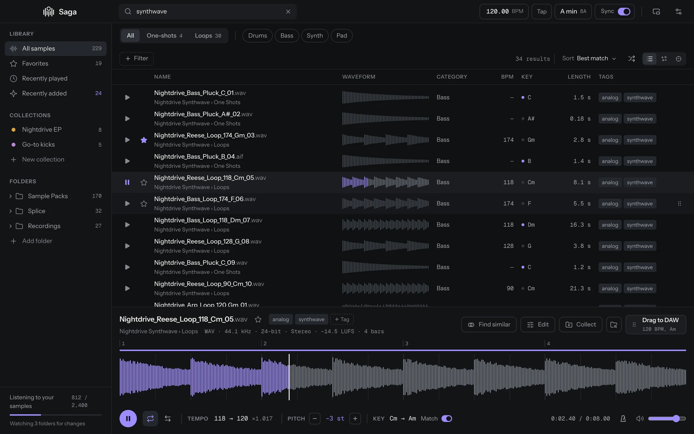
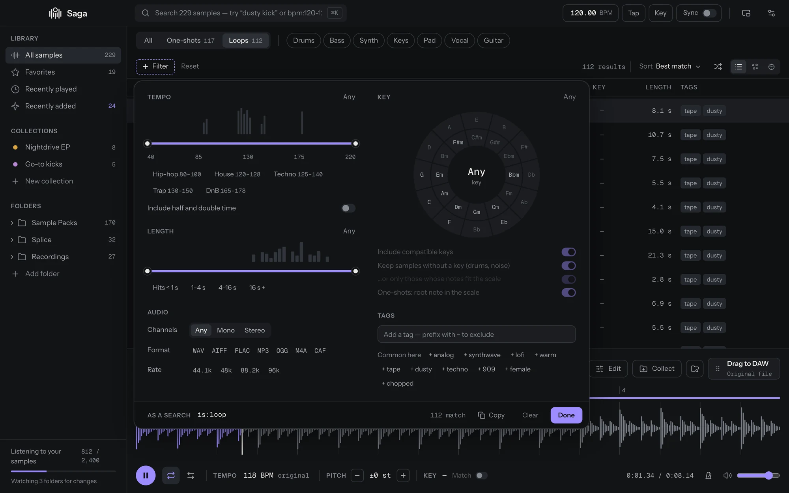
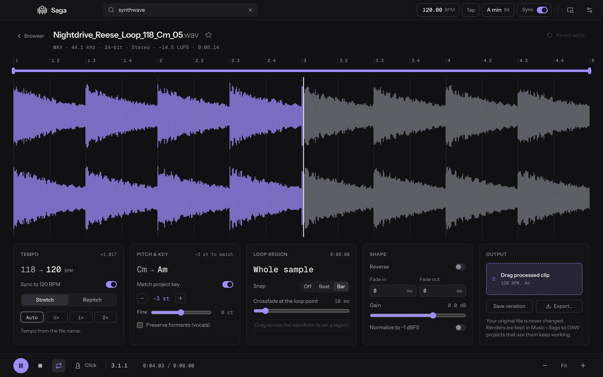
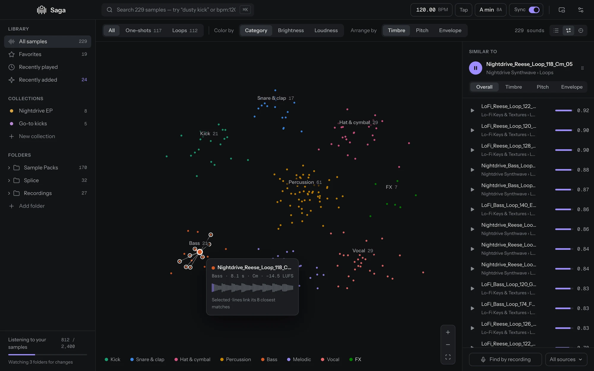
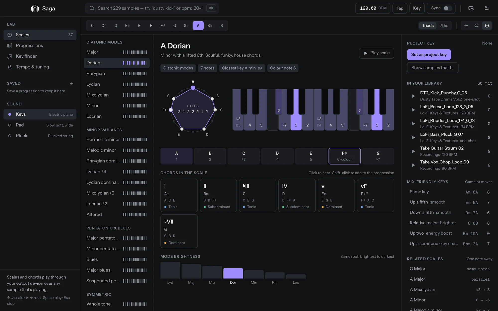
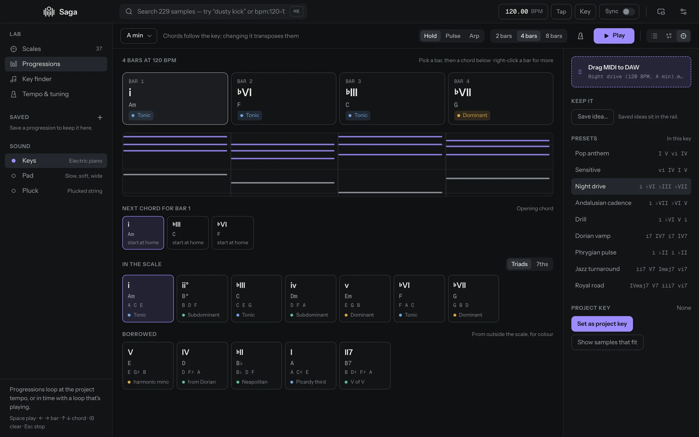

# Saga

**A fast, smart sample browser for music producers.** Point Saga at your sample folders and it
indexes them where they are, works out tempo, key and what each sound is, and lets you search,
audition and drag samples straight into your DAW, already stretched and pitched to fit your
track.

<picture>
  <source media="(prefers-color-scheme: light)" srcset="docs/screenshots/hero-light.webp">
  
</picture>

**[Download Saga](https://github.com/Falciighol/saga/releases/latest)** for macOS (Apple Silicon
and Intel) or Windows.

## Why Saga

- **Nothing moves.** Your folders stay exactly as they are. Saga never moves or copies your
  files, and only renames them when you ask it to.
- **Everything is searchable in an instant**, even across tens of thousands of samples and drives
  that come and go.
- **It hears your samples.** Tempo and key come from file names, embedded loop data or the audio
  itself, and every sound gets a fingerprint for Find similar and the sound map.
- **It plays in your key.** Set a project tempo and key once, and loops follow while you
  audition. Drag one into your DAW and you get exactly what you heard.
- **It stays out of your DAW's way.** Analysis runs at low priority on half your CPU cores, and
  audio devices are only held while you preview or record.
- **It's private.** Everything happens on your computer. The only thing Saga fetches from the
  internet is the update check, and you can turn that off.

## Features

### Your whole library, one search away

Add folders or whole drives with the button, or drop them on the window. Folders are watched, so
new packs appear on their own. Unplug a drive and its favorites and tags wait until it's back.
Untick the folders inside you'd rather leave out when you add one, or right-click a folder later
and choose **Exclude from library**, or pick folders to leave out from Settings; excluded folders
come back from the library folder's right-click menu or Settings. To leave out a kind of folder
everywhere, like the `Vocals` folder inside every pack, add its name under **Leave out folders
named** in Settings (`*` matches anything, so `Stem*` covers `Stems` and `Stem Mixes`).
To tidy the folder list, `⌥`/`Alt`-click a folder's arrow to fold it with everything inside, right-click a
folder › **Collapse subfolders**, or use the button next to **Folders** to close them all.

- **Instant search** over names, folders, categories and tags, plus [field syntax](#search-syntax)
  like `bpm:120-128 key:Am+ is:loop`.
- **Filters** for one-shot or loop, category, tempo (with half and double time), key with Camelot
  compatibility, length, channels, format, sample rate, tags and the date a file was created
  (today, the last 7 or 30 days, this year, or any range of days). Histograms show how your
  library is spread before you pick a range.
- **Columns your way.** Right-click the list's header (or use the button at its end) to show or
  hide columns: date created, date added, format, sample rate, bit depth, channels, loudness and
  times played join the usual ones. Drag a column's title to move it (or focus it and press
  ⌥/Alt ← →), and click it to sort; dates sort newest first. Names always keep their room: when
  the columns don't fit, the list scrolls sideways.
- **Organize** with favorites, collections (right-click a sample, or drop samples on a
  collection; `⌫` takes them out again) and your own tags.
- **Select several** with `⌘`/`Ctrl`-click, `Shift`-click or `⌘`/`Ctrl` `A`, then set their key or
  tempo, rename them, favorite or collect them, or drag them all into your DAW at once.
- **Audition** by selecting: loops repeat, click the waveform to seek (or drag it into your DAW),
  and choose the output device in Settings. Playback has click-free fades. Turn on **Play next** to hear the list
  through: when a sample ends, the next one plays, and loops play once.



### Tempo and key, detected

Saga reads tempo and key in order of trust: what the file name says (`Loop_124_Am`, `128bpm`,
`F# minor`), embedded loop data (ACID chunks in WAV, Apple Loops in AIFF, CAF), then the audio
itself. Values detected from the audio are marked with ≈ (`≈123.8`, `≈Am`) so you know to check
them. Loops cut to whole bars get their exact tempo from their length. Pitched one-shots (808s,
bass, synth and vocal hits) get their root note, and drums and effects never get a key.

On real packs whose names state tempo and key, detection gets the tempo right for 70–80% of
loops. Keys are only shown when the fit is strong, and those are the right key or its relative
about 70% of the time.

When Saga gets one wrong, set it yourself: click the key or tempo in the preview, right-click a
sample, or select several and use the bar that appears. In the Lab's key finder, **Use as its
key** writes the key you settled on onto the sample. Values you set win over everything else,
survive rescans, and drive filters, sorting and key matching; **Use what Saga found** puts the
detected ones back. Tempos show to two decimals when they have them (`123.45`), or always if you
turn on **Tempos with two decimals** in Settings.

### Rename files with their key and tempo

Select samples and choose **Rename…** to write what Saga knows into the file names. Build the new
name from tokens (the current name, folder, collection, number, key, BPM, date created, category)
and any text, or pick a preset like `{name}_{bpm}_{key}`. Click a token again to take it out, or **Clear** to start over.
Choose how keys are written (`F#m`, `F#min`, `F# Min`, `F# minor` or Camelot `11A`), optionally as
their relative major (`F#m` becomes `A`), whether tempos are rounded, and whether they're followed
by `BPM`. **Save as preset…** keeps a pattern with all its choices under your own name, so
`File Name_C Maj_120 BPM_2026-01-01` is one click away next time. Values a name already has are
left out, so `Loop_124_Am` doesn't become `Loop_124_Am_124_Am`. A preview shows every new name and
any clash before anything changes.

To tidy a folder of mismatched names, open it, select everything and use **Folder name and number**
(`{folder} {n}`): `Hip Hop Drums 1`, `Hip Hop Drums 2` and so on, in the order the list shows. From a
collection, `{collection} {n}` does the same with the collection's name. Numbers can start anywhere,
be padded (`01`, `001`) and count across the whole selection or start again in each folder. Files
can trade names, so numbering a folder again just works.

Files are renamed where they are, along with Ableton's `.asd` analysis file next to them, and keep
their favorites, tags and collections. **Undo** puts the old names back. DAW projects that already
use a file will look for it under its old name.

### Fits your track while you listen

Type a project tempo in the title bar (nudge it with `↑ ↓` or tap it) and pick a key from the key
wheel.

- **Sync** plays loops at the project tempo. Stretch keeps the pitch; Repitch speeds up like
  tape. Saga picks half or double time when that's closer, or you choose.
- **Key matching** shifts tonal samples to the project key by the smallest interval, with manual
  semitones and cents on top and formant preservation for vocals.
- **How each key fits** shows next to it in the list and the mini player: `Am in key`,
  `C relative`, `Dm fits`, or `Gm +2 st`, how far key matching would move it.
- **Scale lock** makes `[ ]` step a sample through the project key's scale instead of by
  semitones.
- **The key as MIDI**: drag the tile in the key popup into your DAW for a clip that runs up the
  project key's scale, with a bar for each related key if you want them.

### Shape it, then drag it

Press `E` for the editor: a full-width, zoomable waveform with a bar ruler, a loop region snapped
to bars or beats (with a crossfade at the loop point), reverse, fades, gain and normalize, and a
metronome click locked to the project tempo.



Drag any row, the preview's waveform or the editor's output into your DAW or Finder. A processed sample is
rendered first, and the render matches what you heard because preview and render share the same
code. Renders you drag out are kept in `Music/Saga/Renders` (or a folder you choose in Settings),
so DAW projects that use them keep working; Settings shows how much space they take and can move
old ones to the Trash. You can also **Export…** to any folder, or **Save variation** to add it to your library with the new
tempo and key in its name (`Arp Loop (124 BPM, Bm, reversed).wav`).

### Record from anything

Press `R` for the Record panel and pick what to record: an input (a mic, or an instrument on any
channel or pair of your interface), one app (a browser tab, a player, a plugin's standalone), or
everything you hear except Saga's own sounds. Press `R` again to arm. The take starts on the first
sound, keeps its attack, and ends after a moment of silence. With **Keep going**, every sound
becomes its own take, so eight hits on a drum machine give you eight takes.

A take is a sample straight away: Saga trims the silence around it and finds its tempo and key
(marked ≈), so Sync and Match key work on it like on anything in your library. Drag it into your
DAW, save it (or press Save all above the list to keep every take), or move it to the Trash. Dragging saves it too, into `Music/Saga/Recordings`, which
is part of your library, because your project will use the file. Takes are WAV at the source's
own sample rate, 24-bit or 32-bit float.

Set a shortcut in Settings › Recording to arm, record and stop while your DAW has focus, and the
Dock or taskbar icon shows a red dot while a take records. The mini player has the same controls,
with the newest take ready to drag. Recording one app, or everything you hear, needs macOS 14.2 or
Windows 10 version 2004 or later, and macOS asks once for permission to record other apps.

### Find similar and the sound map

Press `G` (or right-click › Find similar) for the closest-sounding samples in your library,
compared overall or by timbre, pitch or envelope. Drop any audio file on the Similar sounds panel
to search by it, or use **Find by recording** to hum, beatbox or play something into the
microphone.

Press `M` for the **sound map**: every sample laid out so similar sounds sit together, colored by
category, brightness or loudness. Your search and filters light up their matches. Click a sound
to hear it and link its closest matches, or drag across the map to hear each sound you pass.
Shift-drag (or the lasso tool) draws around a group to add it to a collection, and scrolling or
pinching moves around. Details of the sound under the pointer show in the Similar sounds panel,
out of the way of its neighbours.



### The Lab

Press `H` for a workspace for the harmony of a track.

- **Scales**: 37 of them, from the seven modes through harmonic and melodic minor, pentatonics and
  blues to Hirajoshi and Double harmonic. Each shows on a 12-note circle and a keyboard with its
  degrees, the notes that give it its color, and its chords. Click to hear any of it.
- **Back to your library**: make a scale the project key, or show the samples that fit it,
  including keyless samples whose notes fit, best fit first.
- **Progressions**: sketch 2, 4 or 8 bars from the scale's chords, borrowed chords or suggestions
  for what comes next, or start from a preset like Night drive or Andalusian cadence. It plays at
  the project tempo, or locks to the beat of a loop that's playing. Drag the MIDI tile into your
  DAW for a clip of exactly what plays.
- **Key finder**: the keys and scales that fit a sample, or notes you pick on a keyboard.
- **Tempo & tuning**: delay and LFO times at the project tempo, note frequencies at A = 440 or
  432, and *Tune a one-shot*, which measures a kick or 808 and tunes it to the key.





### And also

- **Mini player**: a narrow window with search, the list, the preview and recording that can
  stay on top next to your DAW.
- **Themes and fonts**: Graphite dark and light, six accent colors, a choice of bundled interface
  and numbers fonts (they work offline) or any font installed on your computer, and an interface
  size from 75% to 200%.
- **Updates itself**: new versions download in the background and install when you restart.
  Afterwards a small note says what changed, and Settings › Updates › What's new lists every
  version.

The first time Saga sees your library it listens to every sample once (the sidebar says
"Listening to your samples"). That takes a few minutes for a big library. Search works right
away, and Find similar and the map fill in as it goes.

## Search syntax

| Type            | Means                                          |
| --------------- | ---------------------------------------------- |
| `dusty kick`    | names, folders or tags containing both words   |
| `-dirty`        | exclude a word                                 |
| `bpm:120-128`   | tempo range (`bpm:124` and `bpm:>140` work too) |
| `key:Am`        | exactly A minor (`key:8A` works too)           |
| `key:Am+`       | A minor and compatible keys                    |
| `is:loop`       | loops only (also `is:oneshot`, `is:fav`, `is:mono`) |
| `cat:kick`      | category                                       |
| `tag:warm`      | tag (`-tag:808` to exclude)                    |
| `len:<2s`       | length (`len:1-4s`, `len:>500ms`)              |
| `ext:wav`       | file format                                    |

## Keyboard shortcuts

On Windows, use Ctrl where these say ⌘.

| Browsing | |
| --- | --- |
| `↑ ↓` | Browse samples (⇧ for 10) |
| `Space` / `Enter` | Play or pause / play from the start |
| `←` | Back to the start |
| `F` / `L` | Favorite / toggle looping |
| `⌫` | Remove from the open collection |
| `⌘K` (or `⌘F`, `/`) | Search |
| `⌘⇧F` | Filters |
| `Esc` | Clear the selection or search, close the editor, or stop |
| `⌘A` | Select all results (`⌘`-click or `⇧`-click to select several) |
| `⌘R` | Rename the selected samples |
| `⌘⇧R` | Reveal in Finder (Show in folder on Windows) |
| `⌥`/`Alt`-click a folder's arrow | Open or close it with every folder inside closed |
| `⌘,` | Settings |
| `⌘+` `⌘−` `⌘0` | Interface bigger, smaller, 100% |

| Processing | |
| --- | --- |
| `E` | Editor |
| `⇧R` | Reverse |
| `[ ]` | Semitone down / up (through the key's scale with scale lock) |
| `S` / `K` | Sync to project tempo / match project key |
| `T` | Tap tempo |

| Views | |
| --- | --- |
| `M` | Sound map or list (on the map, `↑ ↓` walk the similar sounds) |
| `G` | Find similar |
| `H` | The Lab (inside it, `↑ ↓ ← →` pick scales, roots, bars and chords, `Space` plays, `⌫` clears a bar and `Esc` stops) |

| Recording | |
| --- | --- |
| `R` | Record panel, then arm, record now and stop |
| `Esc` | Disarm, or stop and keep the take |
| `⌫` / `⌘S` / `F2` | In the takes: move to the Trash / save to Recordings / rename |

## Building from source

```bash
npm install
npm run tauri:dev
```

See [docs/DEVELOPMENT.md](docs/DEVELOPMENT.md) for prerequisites, tests, the code layout and how
releases are made. Saga is built with [Tauri 2](https://tauri.app) (Rust) and React.

## License

Saga is free to use, including for music you release or sell, but it may not be redistributed or
sold. You can read the source, build it and modify it for your own use. See [LICENSE](LICENSE).

If Saga earns a place in your workflow, you can [support its development](https://falcighol.gumroad.com).
Donations are voluntary and don't change what the license gives you.

## Roadmap

Next up: **Ableton Link**, so the project tempo follows your DAW.
